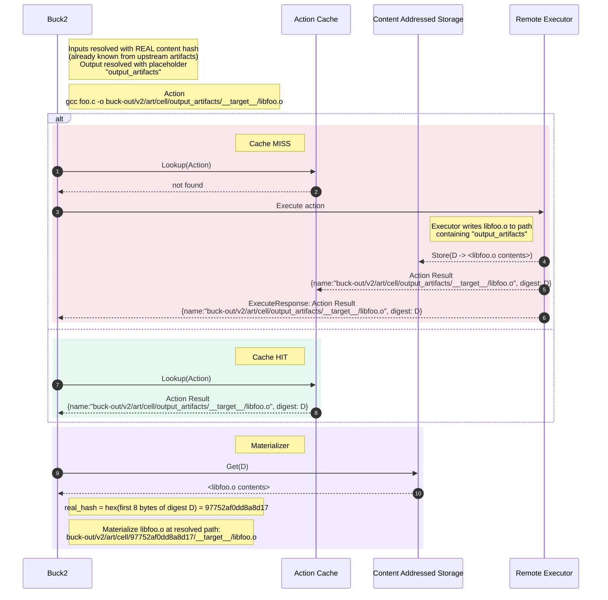
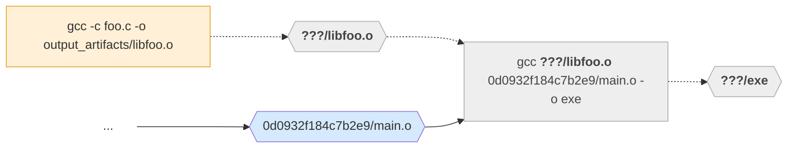
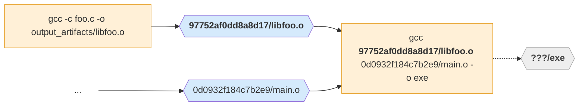
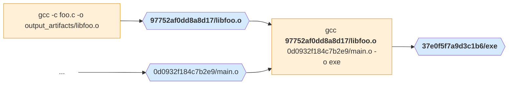

Content-based paths are a mechanism that enables Buck2 to deduplicate work
across different configurations of a target.

## Actions and configurations

A target may appear in multiple
[configurations](../concepts/configurations.md). The purpose of
different configurations is to have slightly different actions run,
e.g. `rustc -O2` in release mode. The focus of this page is actions
which *do not* change like that across configurations, to some degree.
For example:

- [`http_archive`](../../prelude/rules/core/http_archive) and other rules
  that download or decompress static data are
  usually completely independent of configuration.
- Interpreted languages like TypeScript don't usually depend very much
  on configurations. You invoke `tsc`/`esbuild` just the same whether
  you are targeting Linux or Windows, ARM or x86_64, ASAN or no. These
  build actions might depend on just one dimension of the configuration,
  e.g. debug/release.
- For almost any action, it's common to have two different
  configurations that don't affect that particular action (because the
  differing constraints exist solely to affect some other actions).

Historically, Buck2 included the hash of the configuration in the
output path of every output [artifact](../concepts/glossary.md#artifact), so
that artifacts produced under different configurations land in different
locations:

```
buck-out/v2/art/<configuration-hash>/<cell>/__<target>__/<output>
```

The output paths of an action are part of the command line and therefore
part of the hash of an action, which is the cache key. This means that
even if a target's actions *do not* do anything special
depending on the configuration, like `-O2`, Buck2 would
still execute (and cache) those actions separately — once per
configuration.

## Content-based paths and action digests

With content-based paths, we eliminate configuration hashes from the
paths. Instead, an action sees input paths with a content-based hash of the
file as part of the path, and output paths with a placeholder where the
hash goes. After the action has been executed, the output files are
moved to a content-based path, with the hash set to the first 8 bytes of
the digest.

Here are two content-based path renderings:

1. `buck-out/v2/art/cell/output_artifacts/__target__/libfoo.o` (**placeholder**)
2. `buck-out/v2/art/cell/97752af0dd8a8d17/__target__/libfoo.o` (**real content-based path**)

In a given `actions.run()`, all inputs have a **real** content-based path, and
all outputs have **placeholder** paths. You won't see the same artifact
rendered both ways in a given action; an output artifact
(`out.as_output()`) must use a placeholder because we cannot know the
file's hash until we run the action.

When all paths are content-based or placeholders, the same action will
be deduplicated across configurations, because there is no reference to
the configuration hash in the action digest. Note that
the cell name and package/target names are still in the path, so this does
not deduplicate across targets, only across configurations of one
target.

Once an artifact is bound, we hash the file and use a content-based
path when we materialize it or pass it to other actions.

## How content-based paths work with caches

A remote executor does not need to know anything about the path scheme, it
simply writes output artifacts to their placeholder paths as instructed. This
means the scheme is compatible with all remote execution services.

Because they are part of the action, placeholder paths show up in many places:

- The action command line
- The output files listed in an Action sent to RE for execution
- The build logs from the action that produced the file
- The output files listed in an Action Result stored in an Action Cache

When those output artifacts are fed into another action as inputs, we
use the real content-based path. Therefore content-based paths show up
in many places:

- The buck-out directory. When we execute locally, immediately after the execution
  is finished, we move the outputs to their content-based paths.

- The command line and input files to downstream actions. Remote execution materializes
  them at their content-based paths.

### Example remote execution

This example follows these actions

```sh
# elided: compile main.o
gcc -c foo.c -o libfoo.o
gcc libfoo.o main.o -o exe
```

First we will focus on the first action, compiling `libfoo.o`. The diagram shows Buck2 calculating an Action that represents compiling `libfoo.o`, looking it up in the Action Cache, and either:

- **cache miss**: executing the action and populating its entry in the action cache, finally materializing
  `libfoo.o` locally; or

- **cache hit**: materializing `libfoo.o` directly.

The cache hit could be the same action in the same configuration just
requested later, or the same action in a different configuration
experiencing deduplication. The point is it doesn't matter.



Now we'll think about the second action, `gcc libfoo.o main.o -o exe`. This depends on the first action. Before `libfoo.o` is compiled, the second action's action digest is incomplete, and we cannot query the action cache for it:



After `libfoo.o` is resolved to its content-based path, the action digest is
fully known and it can be queried or executed:



And finally querying or executing this action gives you the output artifact `exe`:



## Enabling content-based paths

### On individual actions

Pass `has_content_based_path = True` when declaring outputs:

```python
# A single output.
out = ctx.actions.declare_output("out.txt", has_content_based_path = True)

# All inbuilt action types support it.
ctx.actions.write("header.h", "int x = 1;", has_content_based_path = True)
ctx.actions.run(
    cmd_args,
    category = "compile",
    outputs = [out.as_output()],
    has_content_based_path = True,
)
ctx.actions.copy_file(out, src, has_content_based_path = True)
ctx.actions.download_file(out, url, sha256 = "...", has_content_based_path = True)
```

### Setting a project-wide default

You can configure `declare_output` to default to content-based paths project-wide
in your [`.buckconfig`](../concepts/buckconfig.md):

```ini
[buck2]
  declare_output_has_content_based_path_default = true
```

There is a corresponding key for actions that *implicitly* declare an output by
being passed a string name instead of a declared artifact (e.g.
`ctx.actions.write("header.h", ...)`):

```ini
[buck2]
  action_has_content_based_path_default = true
```

Both default to `false`. Individual actions can still override either default by
passing `has_content_based_path` explicitly.

### In prelude rules

Several prelude rules already expose a `has_content_based_path` attribute that
you can set on the target:

```python
http_archive(
    name = "boost",
    urls = ["https://example.com/boost-1.0.tar.gz"],
    sha256 = "abc123...",
    has_content_based_path = True,
)
```

Rules that support this attribute include `http_archive`, `http_file`,
`remote_file`, `write_file`, `export_file`, and `sh_binary`.

### Deduplication eligibility

For an action to actually benefit from deduplication across configurations, all
of its **outputs** must be content-based and all of its **inputs** must be
eligible for deduplication. An input artifact is considered eligible if:

- It is content-based, or
- It is a source file (source files are the same in all configurations), or
- It is owned by an exec dep (an exec dep is usually the same across
  configurations of the dependent, so the action can still be shared across many
  target configurations)

If any input or output is not eligible, the action will still be executed once
per configuration by virtue of one of the paths including a configuration hash.

The `run()` action accepts an optional `expect_eligible_for_dedupe = True`
parameter. When set, Buck2 will verify at analysis time that the action is fully
eligible for deduplication, and produce a clear error if it is not:

```python
ctx.actions.run(
    cmd_args(...),
    category = "compile",
    outputs = [out.as_output()],
    has_content_based_path = True,
    expect_eligible_for_dedupe = True,
)
```

This can help you enable content based paths across a build graph and eliminate
the causes of duplication.

You can also use `buck2 aquery` to investigate eligibility directly. Each action
exposes attributes that report its dedupe status:

- `buck.all_outputs_are_content_based` — whether every output is content-based.
- `buck.all_inputs_are_eligible_for_dedupe` — whether every input is eligible.
- `buck.all_ineligible_for_dedup_inputs` — the specific inputs that are not
  eligible (only present when there is at least one).

For example, `buck2 aquery <target> --output-attribute 'buck\..*'` will print
these attributes for each action, pointing you directly at the outputs or inputs
that are keeping the action from being deduplicated.

## Anonymous targets and promise artifacts

[Anonymous targets](anon_targets.md) can produce artifacts that
use content-based paths, but the caller must explicitly opt into this. Use
`ctx.actions.assert_has_content_based_path()` when resolving a promised
artifact:

```python
# Inside the rule that invokes an anon target:
promise = ctx.actions.anon_target(...)
artifact = promise.artifact("output")
artifact = ctx.actions.assert_has_content_based_path(artifact)
```

If the resolved artifact does not match the assertion (e.g. the anon target
switches from content-based to configuration-based paths), Buck2 will fail with a
descriptive error.

## Configuration-hash paths and symlinks

Content-based paths are great for deduplication, but they are not predictable:
you cannot know an output's path until its contents have been hashed. That makes
them awkward for anything that needs to refer to a build output by path.

For this reason, the paths Buck2 reports to the outside world are still
*configuration-hash* paths, of the form
`buck-out/v2/art/<configuration-hash>/<cell>/__<target>__/<output>`. These are
what you get from:

- `buck2 build --show-output` (and `--show-full-output`, `--build-report`)
- `buck2 targets --show-output`
- BXL, e.g. the artifact paths returned by `ctx.output.ensure(...)`

Whenever Buck2 materializes a content-based artifact locally — because it is one
of the requested outputs of the build, because it is needed as an input to a
locally run action, or because it is an output of a locally run action — it also
creates a symlink at the configuration-hash path that points to the real
content-based path. This keeps the configuration-hash path that tools were given
valid, while the underlying bytes live at their deduplicated, content-based
location.

## See also

- [Configurations](../concepts/configurations.md)
- [Anon Targets](anon_targets.md)
