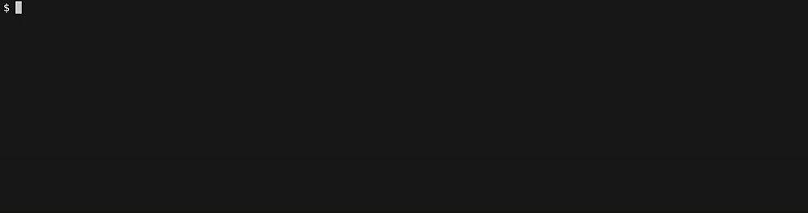

Buck2 offers several console types for build-like commands (e.g. `build`,
`install`, `test`, etc.). The console is always written to stderr.

The console can be specified via the `--console` flag, or the `BUCK_CONSOLE` env
variable. The default console type is `auto`. Supported `--console` types:

- `auto` - Default console type. Auto defaults to the superconsole if the stderr
  is a TTY. Otherwise will uses simple console
- `simple` - Build a simpleconsole with TTY, if TTY is supported by the OS. See
  [Simpleconsole](#simpleconsole)
- `simplenotty` - Build a simpleconsole without TTY. See
  [Simpleconsole](#simpleconsole)
- `simpletty` - Build a simpleconsole with TTY. See
  [Simpleconsole](#simpleconsole)
- `super` - Build a superconsole regardless of whether stderr is a TTY. See
  [Superconsole](#superconsole)
- `none` - See [No console](#no-console)

If `simplenotty` or `none` are specified, or if TTY is not supported by the OS,
then we strip out any color within the error messages.

All console options will output the build result, whether succeeded or not, to
stdout. Note that action execution stderr is hidden if the build succeeded.

The simple and superconsole will also print metadata about the build itself,
such as the Buck2 UUID, the percentage of cache hits, and the number of action
commands ran. In addition, they will print the event spans detected within the
build.

## Simpleconsole

The simpleconsole prints the stdout/stderr messages and event spans, line by
line. There is no resource usage telemetry emitted.

### Demo

## Superconsole

The superconsole uses the
[superconsole](https://github.com/facebookincubator/superconsole) library to
provide an interactive console which shows the event spans going on within
Buck2.

### Demo

### Toggles

The superconsole also provides several toggles to inspect ongoing Buck2
telemetry.

To see what's available you can press `?` or `h`. This will work as long as
stdin is a TTY, which will be true most of the time if you're not piping
anything into Buck2. To disable to allow alternate use of stdin, or for follow
up pasted commands to not get swallowed, you can set the
`BUCK_NO_INTERACTIVE_CONSOLE` environment variable, or use the flag
`--no-interactive-console`.

We support the following toggles:

- `c` - toggle commands (shown in superconsole by default)
- `d` - toggle DICE key states
- `e` - toggle debugging events, such as spans and instant event counts
- `2` - toggle two lines mode when showing events
- `r` - toggle detailed remote execution info, such as uploads, downloads, and
  action cache calls
- `i` - toggle I/O counters
- `p` - display target configurations
- `+` - show more lines
- `-` - show fewer lines
- `h` - show help

## No console

When specifying the `none` console type, Buck2 will only print if the build
succeeded, or the error if the build failed.
