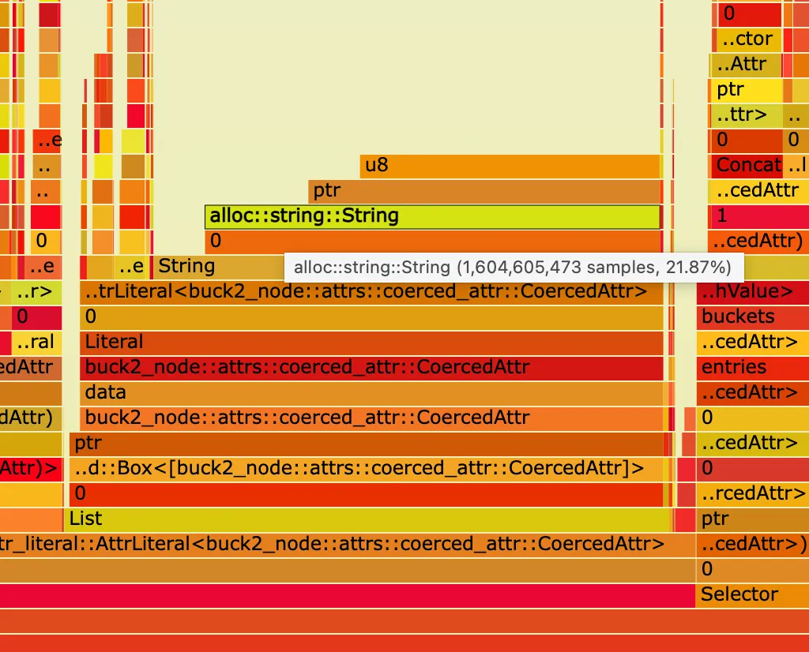

# Allocative: memory profiler for Rust

This crate implements a lightweight memory profiler which allows object
traversal and memory size introspection.

## Usage

`Allocative` trait (typically implemented with proc-macro) is introspectable:
`Allocative` values can be traversed and their size and sizes of referenced
objects can be collected.

This crate provides a few utilities to work with such objects, the main of such
utilities is flame graph builder which produces flame graph (see the crate
documentation) like this:

## How it is different from other call-stack malloc profilers like jemalloc heap profiler

Allocative is not a substitute for call stack malloc profiler, it provides a
different view of memory usage.

Here are some differences between allocative and call-stack malloc profiler:

- Allocative requires implementation of `Allocative` trait for each type which
  needs to be measured, and some setup in the program to enable it is needed
- Allocative flamegraph shows object by object tree, not by call stack
- Allocative shows gaps in allocated memory, e.g. spare capacity of collections
  or too large padding in structs or enums
- Allocative allows profiling of non-malloc allocations (for example,
  allocations within [bumpalo](https://github.com/fitzgen/bumpalo) bumps)
- Allocative allows profiling of memory for subset of the process data (for
  example, measure the size of RPC response before serialization)

## Runtime overhead

When allocative is used, binary size is slightly increased due to
implementations of [`Allocative`] trait, but it has no runtime/memory overhead
when it is enabled but not used.

## Source code

Note there are several copies of this project on GitHub due to how Meta monorepo
is synchronized to GitHub. The main copy is
[facebookexperimental/allocative](https://github.com/facebookexperimental/allocative).

## License

Allocative is both MIT and Apache License, Version 2.0 licensed, as found in the
[LICENSE-MIT](LICENSE-MIT) and [LICENSE-APACHE](LICENSE-APACHE) files.
