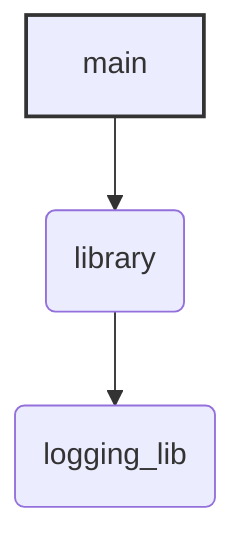
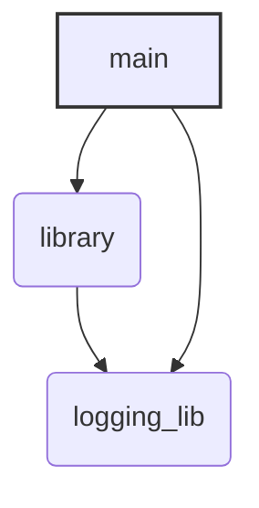

import { FbInternalOnly, OssOnly, isInternal } from
'docusaurus-plugin-internaldocs-fb/internal';

Welcome back! In our [previous tutorial](../tutorial_first_build), we created a
simple "Hello, World!" application. Now, we'll take it a step further by
learning how to create and adding dependencies in our project. This is a common
scenario where you separate concerns into different modules or libraries.

Our goal is to understand how Buck2 manages dependencies.

## What We'll Do:

1. Create a new library directory
2. Create a library with a simple function
3. Define a `rust_binary` target for our library
4. Build the library independently
5. Update our binary to depend on and use this new library
6. Add a logging dependency to our application
7. Build and run the binary

## Prerequisites

- You should follow the [previous tutorial](../tutorial_first_build)

## Step 1: Adding a Library Directory to Your Project

1. Navigate to your project's root directory

<FbInternalOnly>

Navigate to the directory that contains your `greeter_bin` folder, i.e.
`<FBSOURCE>/fbcode/scripts/<unixname>/buck2_lab`.

In your fbsource root,

```bash
cd fbcode/scripts/<unixname>/buck2_lab
```

Replace `<unixname>` with your unixname.

</FbInternalOnly>

<OssOnly>

Navigate to the `buck2_lab` folder we created in the
[previous tutorial](../tutorial_first_build).

</OssOnly>

2. Create the folders needed for your library

```bash
mkdir greeter_lib
mkdir greeter_lib/src
```

Your project should be like this

```
buck2_lab
├── greeter_bin
│   ├── BUCK
│   └── src
│       └── main.rs
└── greeter_lib
    └── src
```

## Step 2: Creating a library

1. Write the library code:

Inside `greeter_lib/src/`, create a file named `lib.rs`. Add the following Rust
code:

```rust
pub fn greet(name: &str) -> String {
    let greeting = format!("Hello, {}!", name);
    greeting
}
```

This is a simple public function greet that takes a name and returns a greeting
message.

2. Define the library's BUCK file: In the `greeter_lib` directory (i.e.,
   `greeter_lib/`), create a `BUCK` file. Add the following content:

<FbInternalOnly>

```python
load("@fbsource//tools/build_defs:rust_library.bzl", "rust_library")

rust_library(
    name = "library",
    srcs = ["src/lib.rs"],
    visibility = ["PUBLIC"],
)
```

</FbInternalOnly>

<OssOnly>

```python
rust_library(
    name = "library",
    srcs = ["src/lib.rs"],
    visibility = ["PUBLIC"],
)
```

</OssOnly>

- `rust_library`: This Buck2 rule is used for compiling Rust libraries.
- `name = "library"`: We're naming our library target "library". This name will
  also be used by default as the crate name for Rust.
- `srcs = ["src/lib.rs"]`: Specifies the source file for this library.
- `visibility = ["PUBLIC"]`: This makes the library visible to all other
  targets.

## Step 3: Building the Library (Optional)

You can build the library by running the following command, in the `greeter_lib`
folder

```bash
cd greeter_lib
buck2 build :library --show-full-output
```

You will see an output like this:

<FbInternalOnly>

```
...
BUILD SUCCEEDED
fbcode//scripts/<unixname>/buck2_lab/greeter_lib:library /.../greeter_lib/__library__/out/LPPMD/liblibrary-1527a50c.rmeta
```

</FbInternalOnly>

<OssOnly>

```
...
BUILD SUCCEEDED
root//buck2_lab/greeter_lib:library /.../greeter_lib/__library__/out/LPPMD/liblibrary-1527a50c.rmeta
```

</OssOnly>

Now, navigate back to the project root:

```bash
cd ..
```

## Step 4: Adding a Dependency to the Binary

Next, we'll modify our binary application to use the `greeter_lib`.

1. Write the binary code:

For `greeter_bin/src/main.rs`, update the code to use `greet` function in
`greeter_lib`:

```rust
fn main() {
    let s = library::greet("buck2");
    println!("{}", s);
}

```

2. Update the binary's BUCK file:

In the `greeter_bin` directory (i.e., `buck2_lab/greeter_bin/BUCK`), update the
BUCK file.

<FbInternalOnly>

```python
load("@fbsource//tools/build_defs:rust_binary.bzl", "rust_binary")

rust_binary(
    name = "main",
    srcs = ["src/main.rs"],
    # Add the dep to our library
    deps = ["fbcode//scripts/<unixname>/buck2_lab/greeter_lib:library"],
)
```

Replace `<unixname>` with your unixname.

</FbInternalOnly>

<OssOnly>

```python
rust_binary(
    name = "main",
    srcs = ["src/main.rs"],
    # Add the dep to our library
    deps = ["root//buck2_lab/greeter_lib:library"],
)
```

</OssOnly>

export const TARGET_NAME = isInternal() ?
<code>fbcode//scripts/&lt;unixname&gt;/buck2_lab/greeter_lib:library</code> :
<code>root//buck2_lab/greeter_lib:library</code>;

You can also use `buck2 targets :` command in `greeter_lib` folder to get the
full target name of the library.

- { isInternal() ? <code>deps =
  ["fbcode//scripts/&lt;unixname&gt;/buck2_lab/greeter_lib:library"]</code> :
  <code>deps = ["root//buck2_lab/greeter_lib:library"]</code> }: This is the
  crucial new part!
  - `deps` declares dependencies for this target. It accepts a list of targets.

## Step 5: Run the Binary

Now, let's build and run our binary application, with dependencies {
isInternal() ?
<code>fbcode//scripts/&lt;unixname&gt;/buck2_lab/greeter_lib:library</code> :
<code>root//buck2_lab/greeter_lib:library</code> }.

1. Run the binary:

<FbInternalOnly>

```bash
buck2 run fbcode//scripts/<unixname>/buck2_lab/greeter_bin:main
```

</FbInternalOnly>

<OssOnly>

```bash
buck2 run root//buck2_lab/greeter_bin:main
```

</OssOnly>

2. Expected output:

You should see the following output:

```
...
BUILD SUCCEEDED - starting your binary
Hello, buck2!
```

## Step 6: Adding a logging dependency to our application

Imagine that as our application grows, we realize we want to log information
about what's happening inside our functions. This is a common need for debugging
or just understanding the flow. To help with this, let's say we've prepared a
simple, shared logging library for you. <FbInternalOnly> The library is
`fbcode//buck2/docs/buck2_lab/logging_lib:logging_lib`. </FbInternalOnly>
<OssOnly> You can find it at
https://github.com/facebook/buck2/tree/main/docs/buck2_lab/logging_lib and copy
the folder into `buck2_lab` folder. </OssOnly>

Our first step is to make our existing greeter_lib use this new logging_lib.

1. Update `greeter_lib/BUCK`:

Now, modify `buck2_lab/greeter_lib/BUCK` to declare a dependency on
`logging_lib`.

<FbInternalOnly>

```python
load("@fbsource//tools/build_defs:rust_library.bzl", "rust_library")

rust_library(
    name = "library",
    srcs = ["src/lib.rs"],
    visibility = ["PUBLIC"],
    deps = [
        # Add the dep to our logging_lib
        "fbcode//buck2/docs/buck2_lab/logging_lib:logging_lib",
    ],
)
```

</FbInternalOnly>

<OssOnly>

```python
rust_library(
    name = "library",
    srcs = ["src/lib.rs"],
    visibility = ["PUBLIC"],
    deps = [
        # Add the dep to our logging_lib
        "root//buck2_lab/logging_lib:logging_lib",
    ],
)
```

</OssOnly>

2. Update `greeter_lib/src/lib.rs`:

```rust
pub fn greet(name: &str) -> String {
    // Let's use our new logging library!
    logging_lib::info("Entered greet function in library");

    let greeting = format!("Hello, {}!", name);

    logging_lib::info("Exiting greet function in library");
    greeting
}
```

3. Update `greeter_bin/src/main.rs`:

```rust
fn main() {
    logging_lib::info("Starting...");

    let message = library::greet("Buck2");
    println!("{}", message);

    logging_lib::info("Exit.");
}
```

## Step 7: The Expected Failure - Understanding Direct vs. Transitive Dependencies

Our dependencies relationship is now like this:



`main` depends on `library`, and `library` depends on `logging_lib`.

Let's try to run `main`:

1. Attempt to run the binary:

<FbInternalOnly>

```bash
buck2 run fbcode//scripts/<unixname>/buck2_lab/greeter_bin:main
```

</FbInternalOnly>

<OssOnly>

```bash
buck2 run root//buck2_lab/greeter_bin:main
```

</OssOnly>

2. Expected Outcome: Build Failure!

You will encounter a compile-time error like this:

```
error[E0433]: failed to resolve: use of unresolved module or unlinked crate `logging_lib`
 --> fbcode/scripts/<unixname>/buck2_lab/greeter_bin/src/main.rs:4:5
  |
4 |     logging_lib::info("Starting...");
  |     ^^^^^^^^^^^ use of unresolved module or unlinked crate `logging_lib`
  |
  = help: you might be missing a crate named `logging_lib`


error[E0433]: failed to resolve: use of unresolved module or unlinked crate `logging_lib`
 --> fbcode/scripts/<unixname>/buck2_lab/greeter_bin/src/main.rs:9:5
  |
9 |     logging_lib::info("Exit.");
  |     ^^^^^^^^^^^ use of unresolved module or unlinked crate `logging_lib`
  |
  = help: you might be missing a crate named `logging_lib`


error: aborting due to 2 previous errors
```

This means that `logging_lib` cannot be found in our `main` binary.

### Why did this fail?

- `greeter_bin/src/main.rs` directly calls `logging_lib::info()`.
- However, `greeter_bin/BUCK` only lists `greeter_lib:library` as a direct
  dependency.
- Even though `greeter_lib:library` depends on `logging_lib`, this dependency is
  not automatically "passed through" (transitive) or made directly available to
  greeter_bin's source code for compilation by Rust.
- For `greeter_bin/src/main.rs` to directly use symbols from `logging_lib`, the
  `logging_lib` crate needs to be explicitly available to `greeter_bin:main`
  during its compilation.

## Step 9: Fixing the Build - Declaring the Direct Dependency

To fix this, we need to tell Buck2 that `greeter_bin` also has a direct
dependency on `logging_lib`.

1. Update `greeter_bin/BUCK`:

<FbInternalOnly>

```python
load("@fbsource//tools/build_defs:rust_binary.bzl", "rust_binary")

rust_binary(
    name = "main",
    srcs = ["src/main.rs"],
    deps = [
        "fbcode//scripts/<unixname>/buck2_lab/greeter_lib:library",
        "fbcode//buck2/docs/buck2_lab/logging_lib:logging_lib",  # Add this line
    ],
)
```

</FbInternalOnly>

<OssOnly>

```python
rust_binary(
    name = "main",
    srcs = ["src/main.rs"],
    deps = [
        "root//buck2_lab/greeter_lib:library",
        "root//buck2_lab/logging_lib:logging_lib",  # Add this line
    ],
)
```

</OssOnly>

2. Run the binary:

<FbInternalOnly>

```bash
buck2 run fbcode//scripts/<unixname>/buck2_lab/greeter_bin:main
```

</FbInternalOnly>

<OssOnly>

```bash
buck2 run root//buck2_lab/greeter_bin:main
```

</OssOnly>

You should see the output like this:

```
...
BUILD SUCCEEDED - starting your binary
[INFO] Starting...
[INFO] Entered greet function in library
[INFO] Exiting greet function in library
Hello, Buck2!
[INFO] Exit.
```

The final dependency graph should be like this:



## Conclusion:

Congratulations! 🥳

You've successfully created a multi-target Rust project with Buck2, where a
binary depends multiple targets!

We've covered:

- Structuring a project with separate library and binary components.
- Defining `rust_library` and `rust_binary` targets.
- Declaring dependencies between targets using the deps attribute.
- Building and running an application that uses libraries dependencies.

This foundational skill of managing dependencies is key to building larger, more
complex applications.
