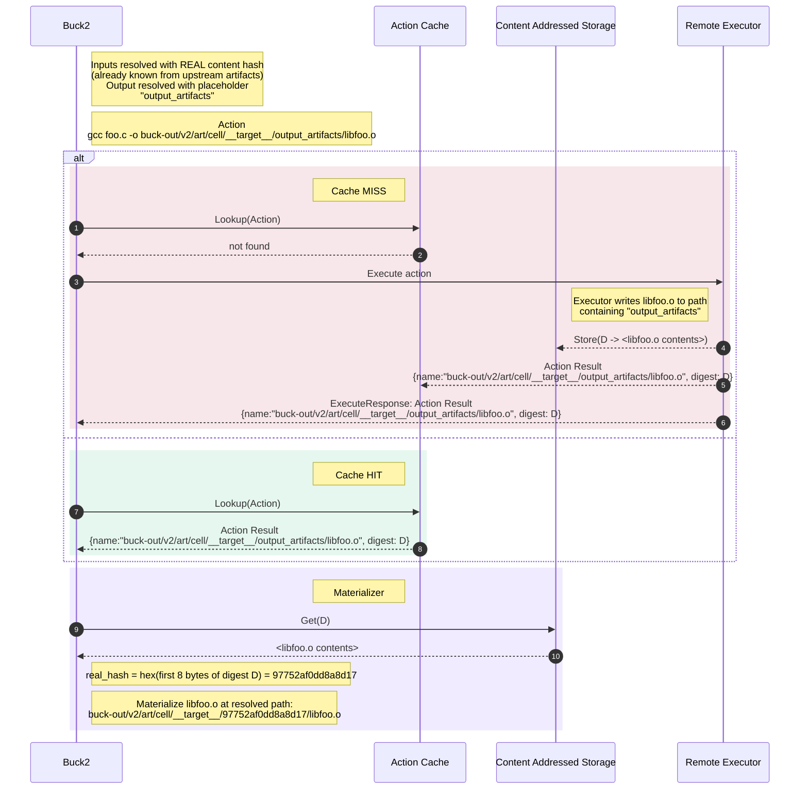
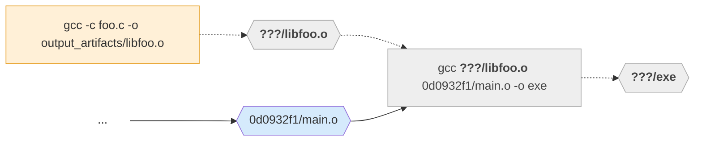
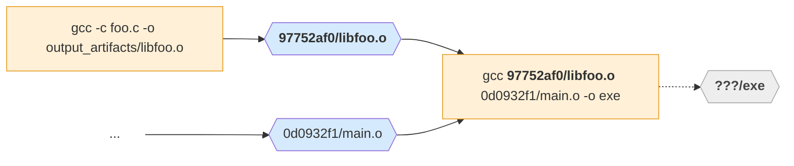
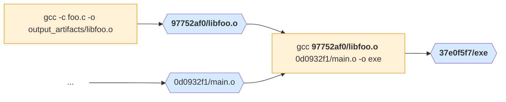

Content-based paths are a mechanism that enables Buck2 to deduplicate work
across different configurations of a target.

:::info
  Content-based paths are not yet the default for all actions, but the
  prelude is moving all possible actions to use content-based paths
  (2026-05).
:::

## Actions and configurations

A target may appear in multiple
[configurations](../concepts/configurations.md). The purpose of
different configurations is to have slightly different actions run,
e.g. `rustc -O2` in release mode. The focus of this page is actions
which *do not* change like that across configurations, to some degree.
For example:

- [`http_archive`](../../prelude/decls/http_archive/) and other rules
  that download or decompress static data are
  usually completely independent of configuration.
- Interpreted languages like TypeScript don't usually depend very much
  on configurations. You invoke `tsc`/`esbuild` just the same whether
  you are targeting Linux or Windows, ARM or x86_64, ASAN or no. These
  build actions might depend on just one dimension of the configuration,
  e.g. debug/release.
- If configuration were used to e.g. select different
  top-level dependencies like an allocator, such that almost every
  action in the build graph is (theoretically) unaffected until the final link.
- In general any action that doesn't select() on a given configuration.

Historically, Buck2 included the hash of the configuration in the
output path of every output [artifact](../concepts/glossary.md#artifact), so
that artifacts produced under different configurations land in different
locations:

```warning
buck-out/v2/gen/<configuration-hash>/<cell>/__<target>__/<output>
```

The output paths of an action are part of the command line and therefore
part of the hash of an action, which is the cache key. This meant that
even if a target's actions *do not* do anything special
depending on the configuration, like `-O2`, Buck2 would
still execute (and cache) those actions separately — once per
configuration.

Ultimately this limited the utility of configurations, because as soon
as you added one, you would multiply the whole build graph and the cache
size would balloon. The alternative is
[.buckconfig](../concepts/buckconfig.md) which cannot be
[transitioned](../concepts/transitions.md) and therefore can only take
one value per build.

**Content-based paths allow different configurations to share parts of
the build graph.** If you have a single build that includes Java and a
bundled C++ library, and you have a configuration setting related to
Java, then content-based paths allow you to share the entire C++ build
graph while toggling different Java settings, simply because the C++
rules do not select() on Java settings. That is the purpose.

## Content-based paths and action keys

With content-based paths, we eliminate configuration hashes from the
paths. Instead, an action sees input paths with a content-based hash of the
file as part of the path, and output paths with a placeholder where the
hash goes. After the action has been executed, the output files are
moved to a content-based path, with the hash set to the first 8 bytes of
the digest.

Here are two content-based path renderings:

1. `buck-out/v2/art/cell/__target__/output_artifacts/libfoo.o` (**placeholder**)
1. `buck-out/v2/art/cell/__target__/97752af0dd8a8d17/libfoo.o` (**real content-based path**)

In a given `actions.run()`, all inputs have a **real** content-based
path, and all outputs have **placeholder** paths.

When all paths are content-based or placeholders, the same action will
be deduplicated across configurations, because there is no reference to
the configuration hash in the action key. Note that
the cell name and package/target names are still in the path, so this does
not deduplicate across targets, only across configurations of one
target.

Once an artifact is bound, we hash the file and use a content-based
path when we materialize it or pass it to other actions. In some cases
this may be optimised if we know the file contents or digest in advance,
e.g. `actions.write()` or `actions.download_file()`.

## How content-based paths work with remote execution

A remote executor does not need to know anything about the path scheme, it
simply writes output artifacts to their placeholder paths as instructed. This
means the scheme is compatible with all remote execution services.

Because they are part of the action, placeholder paths show up in many places:

- The action command line
- The output files listed in an Action sent to RE for execution
- The build logs from the action that produced the file
- The output files listed in an Action Result stored in an Action Cache

When those output artifacts are fed into another action as inputs, we
use the real content-based path. Therefore content-based paths show up
in many places:

- `buck2 build --show-simple-output <target>`

- The buck-out directory. When we execute locally, immediately after the execution
  is finished, we move the outputs to their content-based paths.

- The command line and input files to downstream actions. Remote execution materializes
  them at their content-based paths.

### Example remote execution

This example follows these actions

```sh
# elided: compile main.o
gcc -c foo.c -o libfoo.o
gcc libfoo.o main.o -o exe
```

First we will focus on the first action, compiling `libfoo.o`. The
diagram shows Buck2 calculating an Action that represents compiling
`libfoo.o`,
looking it up in the Action Cache, and alternatively:

- **cache miss**: executing the action and populating its entry in the action cache, finally materializing
  `libfoo.o` locally; or

- **cache hit**: materializing `libfoo.o` directly.

The cache hit could be the same action in the same configuration just
requested later, or the same action in a different configuration
experiencing deduplication. The point is it doesn't matter.



Now we'll think about the second action, `gcc libfoo.o main.o -o exe`.
This depends on the first action. Before `libfoo.o` is compiled, the
second action's action key is incomplete, and we cannot query the
action cache for it:



After `libfoo.o` is resolved to its content-based path, the action key is
fully known and it can be queried or executed:



And finally querying or executing this action gives you the output
artifact `exe`:



## When do content-based paths not work?

Content-based paths are a subtle behaviour change from
configuration-based paths, and have a specific failure mode for a class
of actions. This is when an output file is written that refers by path
to a file/directory that has been written by the same action.

For example, this action won't work quite right:

```python
SCRIPT = """
import sys
import json
from pathlib import Path
output = Path(sys.argv[1])
output.mkdir(parents=True, exist_ok=True)
with open(output / "manifest.json", "w+") as f:
    # path relative into buck-out (a placeholder path right now)
    json.dump({ "somefile": str(output / "somefile.tar.gz") }, f)
"""

def _impl(ctx):
    output = ctx.actions.declare_output("output", dir = True, has_content_based_path = True)
    ctx.actions.run(
        cmd_args("python3", "-c", SCRIPT, output.as_output()),
        category = "category",
    )
    return [DefaultInfo(output)]

myrule = rule(impl=_impl, attrs = {})

## BUCK

load(":defs.bzl", "myrule")
myrule(name="myrule")
```

In this situation, you will get placeholder paths written to the
manifest. Then, after the action executes, the output artifact will be
renamed to its final path, and the placeholder path will be wrong and
won't be present when downstream actions read the manifest and try to
read the paths written in it.

```sh
# repo ; cat $(buck2 build myrule:myrule --show-simple-output)/manifest.json
{"somefile": "buck-out/v2/art/gh_facebook_buck2/myrule/__myrule__/output_artifacts/output/somefile.tar.gz"}
# repo ; file buck-out/v2/art/gh_facebook_buck2/myrule/__myrule__/output_artifacts/output/somefile.tar.gz
... (No such file or directory)
```

To fix it you have some options:

1. Move manifest generation to a separate downstream action that only
   sees resolved content-based paths, if it doesn't need to be generated
   simultaneously
2. Use relative paths within an output directory artifact and adjust
   later actions to resolve relatively
3. Add a build action to convert paths in the artifact
   immediately after writing it (see snippet below)
4. Write output paths with an easy-to-grep sentinel value instead of
   a placeholder path, translate paths found in the manifest in some
   subsequent action. More precise than wholesale sed/replace.

A real-life example is
[#1331](https://github.com/facebook/buck2/pull/1331), where a build
script emitted compiler flags that referred to files in an `OUT_DIR`
that was being written by the same build script. The solution was the
fourth option above.

<details>
<summary>Code snippet to replace paths in an artifact generically</summary>

A fairly generic solution is to perform text replacement of
`output.as_output()` -> `output` using the following trick, with `sed`
or any other text processor:

```python
def _resolve_content_based_path(
    actions: AnalysisActions,
    artifact: Artifact,
    infile: Artifact,
    outfile: OutputArtifact):
    actions.run(
        cmd_args(
            "sh", "-c", # assuming you have sh and sed available
            cmd_args(
                "sed ",
                cmd_args(
                    "s",
                    cmd_args(artifact.as_output(), ignore_artifacts=True),
                    artifact,
                    "g",
                    delimiter=":",
                ),
                " < ", infile,
                " > ", outfile,
                delimiter=""
            ),
        ),
        category = "rewrite_paths",
    )

# ...
manifest = output.project("manifest.json")
manifest2 = ctx.actions.declare_output("manifest.json", has_content_based_path = True)
_resolve_content_based_path(ctx.actions, output, manifest, manifest2.as_output())
```

</details>

## Enabling content-based paths

For the reasons above regarding breakage, you may not be able to enable
content-based paths all at once. So there are many ways to enable it at
different granularities.

### On individual output artifacts

Whether content-based paths are used is determined when the artifact is
declared. To declare a content-based artifact, pass
`has_content_based_path = True` when declaring:

```python
# A single output.
out = ctx.actions.declare_output("out.txt", has_content_based_path = True)
```

All action types that return an artifact support it. This only has an
effect when passing a string filename to get an implicitly declared
artifact:

```python
out = ctx.actions.write("header.h", "int x = 1;", has_content_based_path = True)
out = ctx.actions.copy_file("out", src, has_content_based_path = True)
out = ctx.actions.download_file("out", url, sha256 = "...", has_content_based_path = True)
```

`actions.run` does not take this flag. Instead, configure when creating
a given output artifact.

### Setting a project-wide default

You can configure `declare_output` to default to content-based paths
project-wide in your [`.buckconfig`](../concepts/buckconfig.md), and a
separate default for all other implicitly declared artifacts
(`copy_file`, `symlink_file`, `copy_dir`, `symlinked_dir`, `copied_dir`,
`write`, `write_json`, `download_file`, called as above):

```ini
[buck2]
  declare_output_has_content_based_path_default = true
  action_has_content_based_path_default = true
```

The default is `false`. Individual artifacts can still override this by
passing `has_content_based_path` explicitly.

### In prelude rules

Several prelude rules already expose a `has_content_based_path` attribute that
you can set on the target:

```python
http_archive(
    name = "boost",
    urls = ["https://example.com/boost-1.0.tar.gz"],
    sha256 = "abc123...",
    has_content_based_path = True,
)
```

Rules that support this attribute include `http_archive`, `http_file`,
`remote_file`, `write_file`, `export_file`, and `sh_binary`.

### Deduplication eligibility

For an action to actually benefit from deduplication across configurations, all
of its **outputs** must be content-based and all of its **inputs** must be
eligible for deduplication. An input artifact is considered eligible if:

- It is content-based, or
- It is a source file (source files are the same in all configurations)

If any input or output is not eligible, the action will still be executed once
per configuration by virtue of one of the paths including a configuration hash.

The `run()` action accepts an optional `expect_eligible_for_dedupe = True`
parameter. When set, Buck2 will verify at analysis time that the action is fully
eligible for deduplication, and produce a clear error if it is not:

```python
ctx.actions.run(
    cmd_args(...),
    category = "compile",
    outputs = [out.as_output()],
    expect_eligible_for_dedupe = True,
)
```

This can help you enable content based paths across a build graph and eliminate
the causes of duplication.

Note that we also consider input artifacts owned by an exec dep to be eligible
for the purpose of this error. Usually an exec dep is the same across
configurations of a dependent, so we don't warn about this making your action
ineligible since it can still be shared across many target configurations.

## Anonymous targets and promise artifacts

[Anonymous targets](../rule_authors/anon_targets.md) can produce artifacts that
use content-based paths, but the caller must explicitly opt into this. Use
`ctx.actions.assert_has_content_based_path()` when resolving a promised
artifact:

```python
# Inside the rule that invokes an anon target:
promise = ctx.actions.anon_target(...)
artifact = promise.artifact("output")
artifact = ctx.actions.assert_has_content_based_path(artifact)
```

If the resolved artifact does not match the assertion (e.g. the anon target
switches from content-based to configuration-based paths), Buck2 will fail with a
descriptive error.

## See also

- [Configurations](configurations.md)
- [Anon Targets](anon_targets.md)
