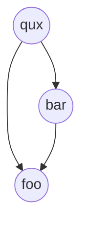

Transitive sets enable the propagation of data up dependency trees in a manner
that is both efficient in Starlark code (low cost of creation, low memory usage)
and efficient for execution by Buck (edges can be shared instead of having each
action depend directly on all its inputs).

Examples of where transitive sets are useful include:

- Propagating transitive link-time dependencies of a library all the way to a
  binary to build.
- Propagating transitive compile-time headers.

## Rule API

First, you need to declare your transitive set type, then you can use it, as
follows:

```starlark
# This is the type
MySet = transitive_set()

# Those are transitive sets:
set1 = ctx.actions.tset(MySet, value = "foo")
set2 = ctx.actions.tset(MySet, value = "bar", children = [set1])
```

Values are optional, and so are children. This means you can have a set with no
value and sets with no children.

## Projections: using transitive sets in command lines

Sets aren't useful unless you can use their contents!

To use a set in a command line, you use a concept called a 'projection', which
defines how to turn individual values found in the set into command line
arguments.

To define a projection, you write a function that takes a value of your set and
returns a command-line like object (`cmd_args`, `string`, `attr.arg()`
attributes, `artifact`, and so on) or a list of them in whichever way makes
sense for your use case.

Then, you call `project_as_args` to turn a set into a value suitable for
inclusion in a command line. When expanded, this projection will expand like a
list of all the node's individual projected values.

Following is an example:

```starlark
# Declare the projection
def project_as_define(value: str):
  return cmd_args(value, format = "-D{}")

# Add it to the set definition
MySet = transitive_set(args_projections = { "define": project_as_define })

# Create a set
set1 = ctx.actions.tset(MySet, value = "foo")
set2 = ctx.actions.tset(MySet, value = "bar", children = [set1])

# Call the projection.
# Note "define" is the key used above in `args_projections`.
args = set2.project_as_args("define")
```

When you use `args` in a command line, it will expand to `-Dbar -Dfoo`.

Note that creating projections is very cheap. Notably, it is independent of the
size of the set.

## Projections: using transitive sets in write_json()

As with command lines, sets can form json projections to be used in write_json.

A json projection is defined in the same way as an arg projection. The function
should return a value that `write_json` otherwise supports. Then, you call
`project_as_json` to turn a set into a value that can be passed to `write_json`
(or can appear within the value passed to it, it doesn't need to be the
top-level value). When expanded, the projection will expand like a list of all
the node's individual projected values.

Following is an example:

```starlark
# Declare the projection
def project_as_json(value: str):
  return struct(key = "foo", value = value)

# Add it to the set definition
MySet = transitive_set(json_projections = { "define": project_as_json })

# Create a set
set1 = ctx.actions.tset(MySet, value = "foo")
set2 = ctx.actions.tset(MySet, value = "bar", children = [set1])

# Call the projection.
# Note "define" is the key we used above in `json_projections`.
args = set2.project_as_json("define")
```

Note that if your projected values include (or may include) artifacts, you will
likely want to use `write_json(with_inputs=True)` to get back a cmd_args that
has all the artifacts in the json structure already in its `.hidden`.

### Traversals in depth

Transitive sets form DAGs. Notably, this means individual nodes can exist more
than once in a given transitive set.

When a transitive set is traversed, nodes that have already been visited are
skipped. This means their arguments will only be emitted once.

For example:



```starlark
set1 = ctx.actions.tset(MySet, value = "foo")
set2 = ctx.actions.tset(MySet, value = "bar", children = [set1])
set3 = ctx.actions.tset(MySet, value = "qux", children = [set1, set2])

args = set3.project_as_args("define")
```

This will expand to `-Dqux -Dfoo -Dbar`, even though `set1` (`"foo"`) shows up
twice in the DAG.

## Other APIs

### Transitive set reductions

You can aggregate values of a transitive set via a reduction. This can be
helpful for tasks such as propagating Boolean flags up the tree.

Following is a real-world example.

When defining a reduction, you receive the reduced values of all your children,
and an optional value for the current node (the value will be `None` when you
create a set and you don't pass a `value`), and you need to merge them together
to produce this node's value:

```starlark
def link_info_has_default_filelist(children: ["bool"], infos: ["LinkInfos", None]):
    if infos:
        info = infos.default
        if info.filelist:
            return True
    return any(children)

# Set of LinkInfos
LinkInfosTSet = transitive_set(
    reductions = {
        "has_default_filelist": link_info_has_default_filelist,
    },
)
```

### Transitive set iteration

You _can_ iterate over a transitive set. This will yield each value once. You
can also iterate over projections.

However, note that this is generally not recommended, since unlike creating and
using a projection, this operation is `O(set)`.

You should use this as an escape hatch if and only if you need to implement
something transitive sets don't support via projections or reductions, because
in doing so you'll lose a lot of the performance benefits.

For example:

```starlark
set1 = ctx.actions.tset(MySet, value = "foo")
set2 = ctx.actions.tset(MySet, value = "bar", children = [set1])
set3 = ctx.actions.tset(MySet, value = "qux", children = [set1, set2])

values = list(set3.traverse())
```

This will yield `["qux", "foo", "bar"]`.

### Ordering

Transitive set iteration uses a left-to-right, pre-order traversal by default,
and ignores nodes that have already been visited. This order is reflected in
projections as well.

A few different traversal orders are supported with the `ordering` attribute:

| Ordering             | Description                                                                                                                                                                                                                                             |
| -------------------- | ------------------------------------------------------------------------------------------------------------------------------------------------------------------------------------------------------------------------------------------------------- |
| `preorder` (default) | Traverses using a depth-first-search, visiting nodes left-to-right.                                                                                                                                                                                     |
| `postorder`          | Traverses children left-to-right, and then visits the current node.                                                                                                                                                                                     |
| `topological`        | A Topological sort, such that nodes are listed after all nodes that have them as descendants. This is similar to a pre-order traversal, except that when nodes are shared with more than one parent it is returned in the order of its last occurrence. |
| `bfs`                | Breadth-first-search (BFS) traversal, traverses nodes left-to-right before traversing children.                                                                                                                                                         |

For example:

```starlark src=fbcode/buck2/app/buck2_build_api_tests/src/interpreter/transitive_set/tests.rs
set1 = ctx.actions.tset(MySet, value = "foo")
set2 = ctx.actions.tset(MySet, value = "bar", children = [set1])
set3 = ctx.actions.tset(MySet, value = "qux", children = [set1, set2])

values = list(set3.traverse(ordering = "topological"))

# This also works for projections
args = set3.project_as_args("project", ordering = "topological"))
```

Following is an example of how different orderings evaluate:


| Ordering      | Result                  |
| ------------- | ----------------------- |
| `preorder`    | `["qux", "foo", "bar"]` |
| `postorder`   | `["foo", "bar", "qux"]` |
| `topological` | `["qux", "bar", "foo"]` |
| `bfs`         | `["qux", "foo", "bar"]` |

<FbInternalOnly>

This is verified by the test:

```starlark src=fbcode/buck2/app/buck2_build_api_tests/src/interpreter/transitive_set/tests.rs title=fbcode/buck2/app/buck2_build_api_tests/src/interpreter/transitive_set/tests.rs
# Test all orderings which show up in the table.
assert_eq(list(set3.traverse()), ["qux", "foo", "bar"])
assert_eq(list(set3.traverse(ordering = "preorder")), ["qux", "foo", "bar"])
assert_eq(list(set3.traverse(ordering = "postorder")), ["foo", "bar", "qux"])
assert_eq(list(set3.traverse(ordering = "topological")), ["qux", "bar", "foo"])
assert_eq(list(set3.traverse(ordering = "bfs")), ["qux", "foo", "bar"])
```

</FbInternalOnly>

## Implementation details

### Projection evaluation

Projections are evaluated eagerly for each node of your transitive set. This
means that if your projection throws an error, you'll find out when creating a
set via `ctx.actions.tset`.
