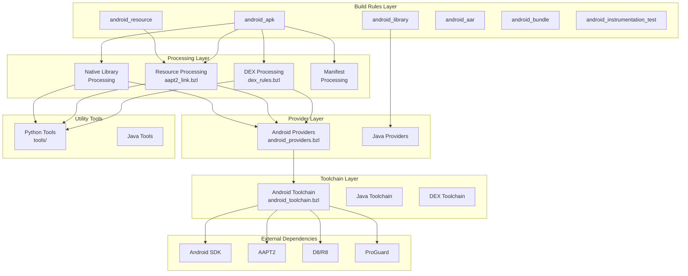
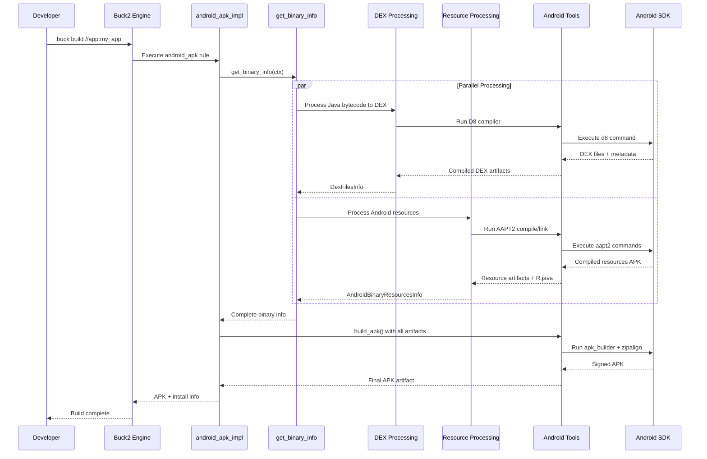
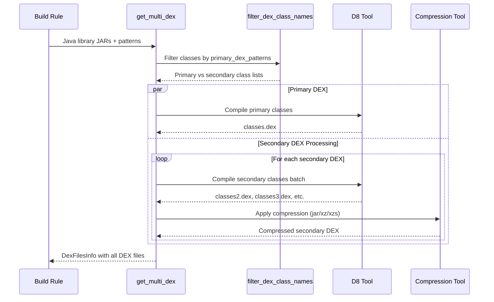

# Buck2 Android Prelude

## 1. 🧭 Overview

The Buck2 Android Prelude is a comprehensive build system for Android
applications and libraries within Meta's Buck2 build system. It provides a
complete set of build rules, toolchain integrations, and utilities for building
Android APKs, AABs (Android App Bundles), libraries, and running tests.

### Key Features

- **Complete Android Build Pipeline**: From Java/Kotlin source code to signed
  APKs and AABs
- **Multi-DEX Support**: Advanced DEX file splitting and optimization with
  multiple compression strategies
- **Resource Processing**: AAPT2-based resource compilation and linking with
  R.java generation
- **Native Library Integration**: Support for native libraries across multiple
  CPU architectures
- **Exopackage Support**: Dynamic loading of DEX files, native libraries, and
  resources for faster development
- **Voltron Modularity**: Support for modular Android applications with dynamic
  feature modules
- **Testing Framework**: Comprehensive testing support including instrumentation
  tests and Robolectric
- **Toolchain Integration**: Deep integration with Android SDK tools, ProGuard,
  and D8/R8

### Technologies Used

- **Language**: Starlark (Buck2's build language), Python (utility tools), Java
  (toolchain components)
- **Framework**: Buck2 build system with Android SDK integration
- **Tools**: AAPT2, D8/R8, ProGuard, Android SDK tools, zipalign
- **Infrastructure**: Remote execution support, caching, and distributed builds

---

## 2. 🧱 High-Level Architecture Diagram

### Component Explanations

- **Build Rules Layer**: High-level build rules that developers use in their
  BUCK files
- **Processing Layer**: Core logic for transforming inputs (Java bytecode,
  resources, native libs) into Android-specific formats
- **Provider Layer**: Data structures that pass information between build rules
  and processing steps
- **Toolchain Layer**: Configuration and integration with external Android
  development tools
- **Utility Tools**: Python and Java utilities that perform specific processing
  tasks
- **External Dependencies**: Android SDK tools and third-party tools integrated
  into the build process

---

## 3. 🔎 Component Breakdown

### Component: Build Rules (`android.bzl`)

**Purpose**: Defines the main Android build rules that developers use in BUCK
files. Acts as the entry point and orchestrates the entire Android build
process.

**Key Elements**:

- `android_apk_impl`: Builds signed APK files from Java code, resources, and
  native libraries
- `android_library_impl`: Compiles Java/Kotlin code into libraries with
  Android-specific processing
- `android_resource_impl`: Processes Android resources (layouts, strings,
  drawables) using AAPT2
- `android_aar_impl`: Creates Android Archive (AAR) files for library
  distribution
- `android_bundle_impl`: Generates Android App Bundles (AAB) for Play Store
  distribution

**Depends On**:

- Internal: All processing modules, providers, toolchain configurations
- External: Android SDK, Java toolchain, native toolchains

### Component: Android Providers (`android_providers.bzl`)

**Purpose**: Defines data structures and providers that carry information
between different build rules and processing steps. Ensures type safety and
structured data flow.

**Key Elements**:

- `AndroidApkInfo`: Contains APK artifact, manifest, and metadata
- `AndroidResourceInfo`: Resource compilation outputs, R.java packages, AAPT2
  artifacts
- `AndroidBinaryNativeLibsInfo`: Native library directories, shared libraries,
  exopackage info
- `DexFilesInfo`: Primary and secondary DEX files with compression metadata
- `AndroidPackageableInfo`: Transitive dependency information for packaging

**Depends On**:

- Internal: Java providers, transitive set utilities
- External: Buck2 provider framework

### Component: DEX Processing (`dex_rules.bzl`)

**Purpose**: Handles conversion of Java bytecode to Android DEX format with
sophisticated multi-DEX splitting, compression, and optimization strategies.

**Key Elements**:

- `get_multi_dex()`: Creates primary and secondary DEX files with weight-based
  splitting
- `merge_to_split_dex()`: Merges pre-dexed libraries into split DEX
  configuration
- `get_single_primary_dex()`: Simple single DEX file generation for smaller apps
- DEX compression strategies: raw, jar, xz, xzs formats

**Depends On**:

- Internal: Android toolchain, Voltron module system, Java DEX utilities
- External: D8/R8 compiler, Android runtime

### Component: Resource Processing (`aapt2_link.bzl`, `android_resource.bzl`)

**Purpose**: Processes Android resources using AAPT2, generates R.java files,
handles resource merging and filtering.

**Key Elements**:

- `aapt2_link()`: Links compiled resources into APK-ready format
- Resource compilation and optimization
- R.java generation with package management
- Asset processing and filtering

**Depends On**:

- Internal: Android toolchain, manifest processing
- External: AAPT2, Android SDK

### Component: Android Toolchain (`android_toolchain.bzl`)

**Purpose**: Configures and provides access to all Android SDK tools and
utilities needed for the build process.

**Key Elements**:

- `AndroidToolchainInfo`: Provider containing all tool references
- Tool configurations: aapt2, d8_command, zipalign, adb, aidl
- Build configuration: android_jar, proguard_jar, framework files
- Utility tools: apk_builder, bundle_builder, duplicate_class_checker

**Depends On**:

- Internal: None (leaf component)
- External: Android SDK, build tools, platform tools

### Component: Python Utility Tools (`tools/`)

**Purpose**: Provides specialized Python scripts for various Android build
processing tasks that require complex logic or file manipulation.

**Key Elements**:

- `duplicate_class_checker.py`: Validates no duplicate classes in DEX files
- `filter_dex.py`: Filters DEX files based on patterns and weight limits
- `unpack_aar.py`: Extracts and processes AAR file contents
- `combine_native_library_dirs.py`: Merges native library directories
- `native_libs_as_assets_metadata.py`: Generates metadata for native libraries
  stored as assets

**Depends On**:

- Internal: Build system file I/O
- External: Python standard library, zipfile, json modules

### Component: Testing Framework (`android_instrumentation_test.bzl`, `robolectric_test.bzl`)

**Purpose**: Provides comprehensive testing capabilities for Android
applications including on-device instrumentation tests and JVM-based Robolectric
tests.

**Key Elements**:

- `android_instrumentation_test_impl`: On-device testing with APK installation
- `robolectric_test_impl`: Fast JVM-based testing with Android framework
  simulation
- Test APK generation and signing
- Test runner integration and result processing

**Depends On**:

- Internal: APK building, Android toolchain, Java testing framework
- External: Android testing framework, Robolectric, ADB

---

## 4. 🔁 Data Flow & Call Flow Examples

### Example Flow: APK Build Process

**Description**: Complete end-to-end process of building a signed APK from
source code, resources, and dependencies. This represents the most common and
comprehensive workflow in the Android build system.

**Sequence Diagram**:

### Example Flow: Multi-DEX Processing

**Description**: Process of splitting Java bytecode into primary and secondary
DEX files based on patterns and weight limits, with support for different
compression strategies.

**Sequence Diagram**:

---

## 5. 🗃️ Data Models (Entities)

### Entity: AndroidApkInfo

- **Provider**: AndroidApkInfo
- **Fields**:
  - `apk: Artifact` – The final signed APK file
  - `manifest: Artifact` – Processed AndroidManifest.xml
  - `materialized_artifacts: list[Artifact]` – All build artifacts for debugging
  - `unstripped_shared_libraries: Artifact` – Debug symbols for native libraries

- **Relations**:
  - Used by installation and testing rules
  - Contains references to all build artifacts

- **Notes**: Primary output provider for android_apk and android_binary rules

### Entity: AndroidResourceInfo

- **Provider**: AndroidResourceInfo
- **Fields**:
  - `raw_target: TargetLabel` – Target that produced this resource
  - `aapt2_compile_output: Artifact` – Compiled resource artifacts from AAPT2
  - `res: Artifact` – Raw resource directory or mapping
  - `assets: Artifact` – Asset files directory or mapping
  - `r_dot_java_package: str` – Package name for R.java generation
  - `text_symbols: Artifact` – Symbol definitions for resource linking
  - `manifest_file: Artifact` – Associated AndroidManifest.xml

- **Relations**:
  - Aggregated by AndroidPackageableInfo
  - Used by resource linking process
  - Referenced by APK and AAR generation

- **Notes**: Represents processed Android resources with AAPT2 compilation
  outputs

### Entity: DexFilesInfo

- **Record**: DexFilesInfo
- **Fields**:
  - `primary_dex: Artifact` – Main classes.dex file
  - `primary_dex_class_names: Artifact` – List of classes in primary DEX
  - `root_module_secondary_dex_dirs: list[Artifact]` – Secondary DEX directories
    for root module
  - `non_root_module_secondary_dex_dirs: list[Artifact]` – Secondary DEX for
    feature modules
  - `secondary_dex_exopackage_info: ExopackageDexInfo` – Exopackage metadata for
    dynamic loading
  - `proguard_text_files_path: Artifact` – ProGuard mapping files

- **Relations**:
  - Used by APK building process
  - Contains exopackage information for dynamic loading
  - References ProGuard optimization outputs

- **Notes**: Central data structure for DEX file management with multi-DEX and
  exopackage support

### Entity: AndroidPackageableInfo

- **Provider**: AndroidPackageableInfo
- **Fields**:
  - `target_label: TargetLabel` – Target producing this info
  - `build_config_infos: AndroidBuildConfigInfoTSet` – Transitive build
    configurations
  - `deps: AndroidDepsTSet` – Transitive dependency information
  - `manifests: ManifestTSet` – Transitive manifest files
  - `resource_infos: ResourceInfoTSet` – Transitive resource information
  - `prebuilt_native_library_dirs: PrebuiltNativeLibraryDirTSet` – Transitive
    native libraries

- **Relations**:
  - Aggregates information from all transitive dependencies
  - Used by binary rules for packaging decisions
  - Contains transitive sets for efficient dependency management

- **Notes**: Core provider for dependency aggregation using Buck2's transitive
  set system

### Entity: AndroidToolchainInfo

- **Provider**: AndroidToolchainInfo
- **Fields**:
  - `aapt2: RunInfo` – AAPT2 resource compiler tool
  - `d8_command: RunInfo` – D8 DEX compiler
  - `android_jar: Artifact` – Android SDK JAR file
  - `apk_builder: RunInfo` – APK assembly and signing tool
  - `zipalign: RunInfo` – APK optimization tool
  - `proguard_jar: Artifact` – ProGuard obfuscation tool
  - `duplicate_class_checker: RunInfo` – Validation tool for duplicate classes
  - `installer: RunInfo` – APK installation tool

- **Relations**:
  - Used by all Android build rules
  - Provides access to external Android SDK tools
  - Configured by toolchain setup rules

- **Notes**: Central configuration point for all Android development tools and
  SDK integration
