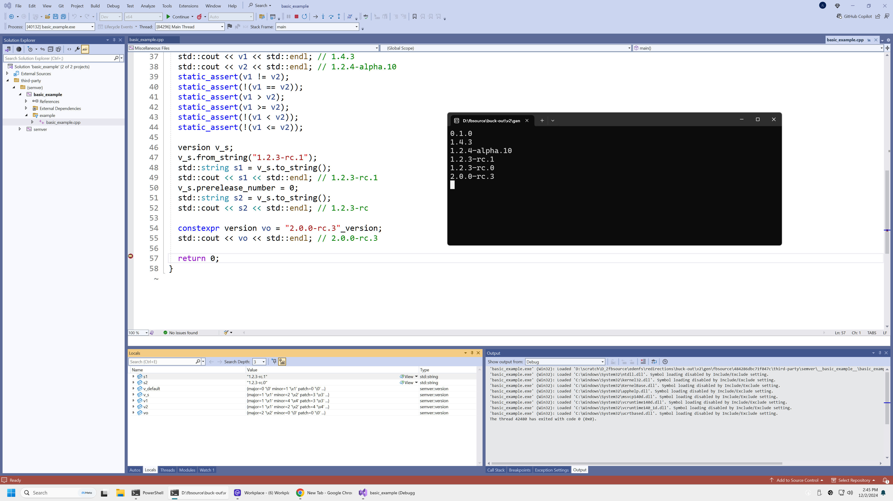
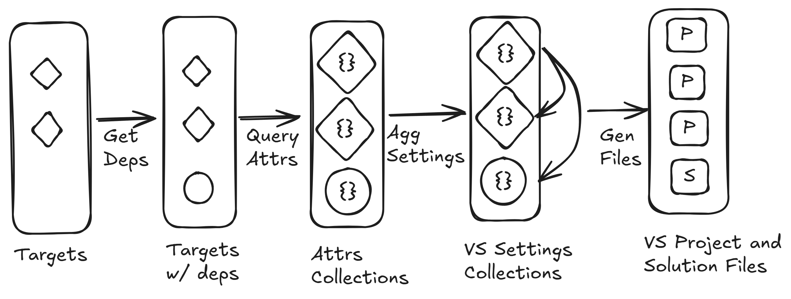

# VSGO: Visual Studio project generation for buck targets

VSGO is a project generator that generates Visual Studio project and solution
files given buck target labels or patterns, with full functional IntelliSense
and build/run/debug setup.

The majority of heavy lifting is implemented in
[BXL](https://buck2.build/docs/developers/bxl/), Buck Extension Language, which
offers superb performance and handles incremental changes extremely well.



## Quick Start

Use project "buck2/examples/vscode" as an example,

```
mkdir modes && echo "" > modes/debug  # One-time setup. Skip if there is one already exists.
python prelude/ide_integrations/visual_studio/vsgo.py root//:main --mode_files modes/debug
```

This will generate project and solution files for the specific target and output
file paths at the end. From there, you can continue with Visual Studio to
browse, edit, and run/debug your buck target.

To list all options and their help docs, run

```
python prelude/ide_integrations/visual_studio/vsgo.py --help
```

## How It Works


