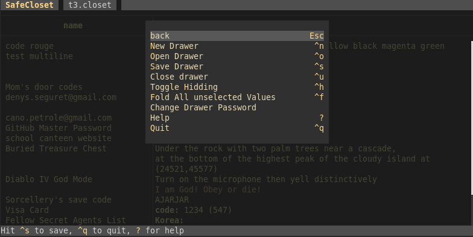
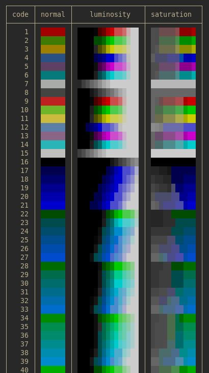
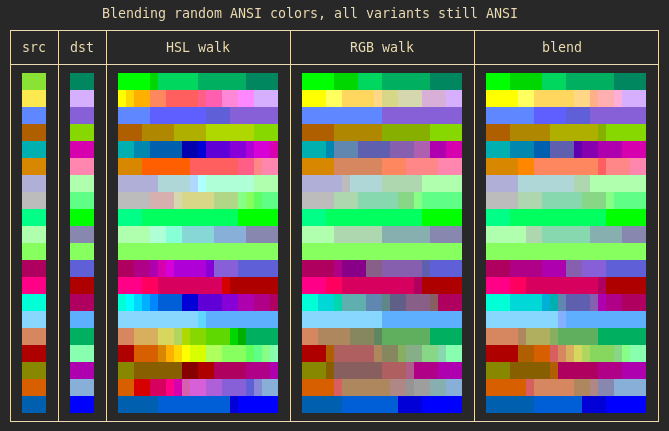

[![MIT][s2]][l2] [![Latest Version][s1]][l1] [![docs][s3]][l3] [![Chat on Miaou][s4]][l4]

[s1]: https://img.shields.io/crates/v/coolor.svg
[l1]: https://crates.io/crates/coolor

[s2]: https://img.shields.io/badge/license-MIT-blue.svg
[l2]: LICENSE

[s3]: https://docs.rs/coolor/badge.svg
[l3]: https://docs.rs/coolor/

[s4]: https://miaou.dystroy.org/static/shields/room.svg
[l4]: https://miaou.dystroy.org/3

Definition of ANSI, RGB and HSL color types and all the conversions between them.

There are many other color conversion crates.
This one is no-std and may be useful when you're interested into

- variations of an ANSI color for your TUI application, for example fading, lightening, darkening, with compatibility with terminals that don't support RGB.
- translations of color schemes
- automatic downgrading of RGB color schemes for non RGB terminals
- automated building of harmonious color schemes with guarantees of contrast
- etc.

Coolor is used in [SafeCloset](https://github.com/Canop/safecloset) to dynamically fade the background behind a dialog:

Be warned that the ANSI range is intrinsically limited to 240 colors and that not all intuitive operations will give good results.

Coolor doesn't contain functions to print on the terminal, but the colors can be used in other crates.
There's an optional [feature](features.md) for conversion from and into [Crossterm](https://github.com/crossterm-rs/crossterm) colors.

## Included Examples

### ansi-variations

Luminosity and saturation variations of all 240 ANSI colors, with all variants still ANSI colors.

### ansi-mix

Several ways to mix colors

