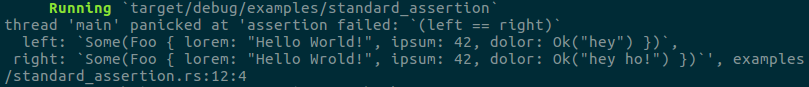
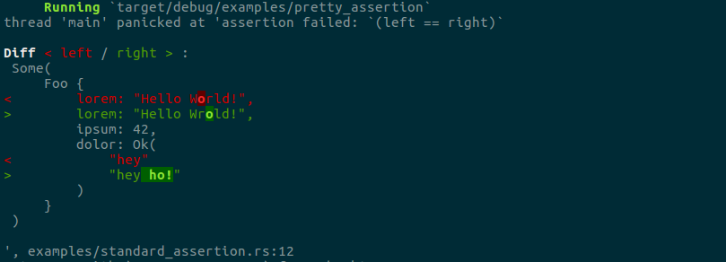

[](https://travis-ci.org/colin-kiegel/rust-pretty-assertions)
[](https://crates.io/crates/pretty-assertions)
[](https://crates.io/crates/pretty-assertions)
[](https://crates.io/crates/pretty-assertions)

# Pretty Assertions

When writing tests in Rust, you'll probably use `assert_eq!(a, b)` _a lot_.

If such a test fails, it will present all the details of `a` and `b`. 
But you have to spot the differences yourself, which is not always straightforward,
like here:



Wouldn't that task be _much_ easier with a colorful diff?



Yep — and you only need **one line of code** to make it happen:

```rust,ignore
use pretty_assertions::{assert_eq, assert_ne};
```

<details>
<summary>Show the example behind the screenshots above.</summary>

```rust,ignore
// 1. add the `pretty_assertions` dependency to `Cargo.toml`.
// 2. insert this line at the top of each module, as needed
use pretty_assertions::{assert_eq, assert_ne};

fn main() {
    #[derive(Debug, PartialEq)]
    struct Foo {
        lorem: &'static str,
        ipsum: u32,
        dolor: Result<String, String>,
    }

    let x = Some(Foo { lorem: "Hello World!", ipsum: 42, dolor: Ok("hey".to_string())});
    let y = Some(Foo { lorem: "Hello Wrold!", ipsum: 42, dolor: Ok("hey ho!".to_string())});

    assert_eq!(x, y);
}
```
</details>

## Tip

Specify it as [`[dev-dependencies]`](http://doc.crates.io/specifying-dependencies.html#development-dependencies)
and it will only be used for compiling tests, examples, and benchmarks.
This way the compile time of `cargo build` won't be affected!

Also add `#[cfg(test)]` to your `use` statements, like this:

```rust,ignore
#[cfg(test)]
use pretty_assertions::{assert_eq, assert_ne};
```

## Note

* Since `Rust 2018` edition, you need to declare
  `use pretty_assertions::{assert_eq, assert_ne};` per module.
  Before you would write `#[macro_use] extern crate pretty_assertions;`.
* The replacement is only effective in your own crate, not in other libraries
  you include.
* `assert_ne` is also switched to multi-line presentation, but does _not_ show
  a diff.
* Under Windows, the terminal state is modified to properly handle VT100 
  escape sequences, which may break display for certain use cases.

## License

Licensed under either of

- Apache License, Version 2.0, ([LICENSE-APACHE](LICENSE-APACHE) or <http://www.apache.org/licenses/LICENSE-2.0>)
- MIT license ([LICENSE-MIT](LICENSE-MIT) or <http://opensource.org/licenses/MIT>)

at your option.

### Contribution

Unless you explicitly state otherwise, any contribution intentionally
submitted for inclusion in the work by you, as defined in the Apache-2.0
license, shall be dual licensed as above, without any additional terms or
conditions.
