[![MIT][s2]][l2] [![Latest Version][s1]][l1] [![docs][s3]][l3] [![Chat on Miaou][s4]][l4]

[s1]: https://img.shields.io/crates/v/termimad.svg
[l1]: https://crates.io/crates/termimad

[s2]: https://img.shields.io/badge/license-MIT-blue.svg
[l2]: LICENSE

[s3]: https://docs.rs/termimad/badge.svg
[l3]: https://docs.rs/termimad/

[s4]: https://miaou.dystroy.org/static/shields/room.svg
[l4]: https://miaou.dystroy.org/3

A CLI utilities library leveraging Markdown to format terminal rendering, allowing separation of structure, data and skin.

Based on [crossterm](https://github.com/TimonPost/crossterm) so works on most terminals (even on windows).

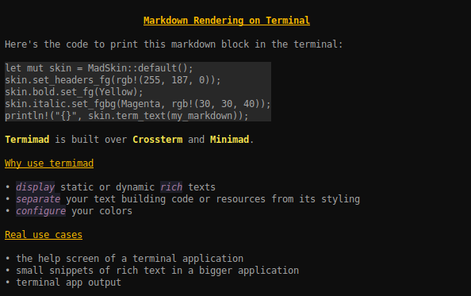

The goal isn't to display any markdown text with its various extensions (a terminal isn't really fit for that). The goal is rather to improve the display of texts in a terminal application when we want both the text and the skin to be easily configured.

Termimad also includes a few utilities helping efficient managing of events and user input in a multithread application.

**Wrapping**, table balancing, and **scrolling** are essential features of Termimad.

A text or a table can be displayed in an *a priori* unknown part of the screen, scrollable if desired, with a dynamically discovered width.

For example this markdown:

    |:-:|:-:|-
    |**feature**|**supported**|**details**|
    |-:|:-:|-
    | tables | yes | pipe based, with or without alignments
    | italic, bold | yes | star based |
    | inline code | yes | `with backquotes` (it works in tables too)
    | code bloc | yes |with tabs or code fences
    | syntax coloring | no |
    | crossed text |  ~~not yet~~ | wait... now it works `~~like this~~`
    | horizontal rule | yes | Use 3 or more dashes (`---`)
    | lists | yes|* unordered lists supported
    |  | |* ordered lists *not* supported
    | quotes |  yes |> What a wonderful time to be alive!
    | links | no | (but your terminal already handles raw URLs)
    |-

will give different results depending on the width:

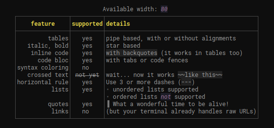

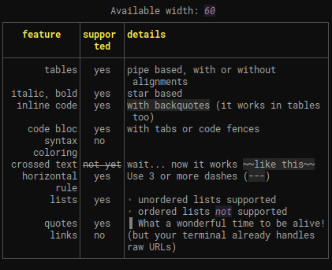

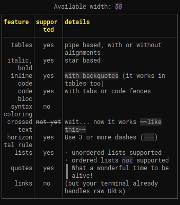

##  Usage

```toml
[dependencies]
termimad = "0.14"
```

### With the default skin:

```rust
termimad::print_inline("**some** *nested **style*** and `some(code)`");
```
or
```rust
print!("{}", termimad::inline("**some** *nested **style*** and `some(code)`"));
```

Result:

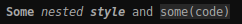

### Inline snippets with a custom skin:

*Inline snippets* are one line or less.

```rust
let mut skin = MadSkin::default();
skin.bold.set_fg(Yellow);
skin.print_inline("*Hey* **World!** Here's `some(code)`");
skin.paragraph.set_fgbg(Magenta, rgb(30, 30, 40));
skin.italic.add_attr(Underlined);
println!("\nand now {}\n", skin.inline("a little *too much* **style!** (and `some(code)` too)"));
```

Result:

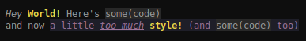

#### Texts

*Texts* can be several lines. Tables and code blocks are automatically aligned, justified and consistently wrapped.

```rust
skin.print_text("# title\n* a list item\n* another item");
```

### Scrollable TextView in a raw terminal:

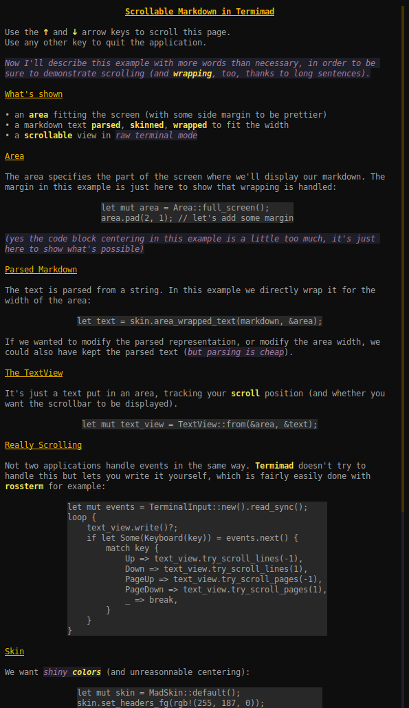

The code for this example is in examples/scrollable. To read the whole text just do

    cargo run --example scrollable

### Templates

In order to separate the rendering format from the content, you may want to have some constant markdown and fill some placeholders with dynamic items.

The `format!` macro is not always a good solution for that because you may not be sure the content is free of characters which may mess the markdown.

A solution is to use one of the templating functions or macros.

A template is to markdown what a prepared statement is to SQL: interpreted once and preventing the content to be interpreted as parts of the structure.

#### Inline Templates

Example:

```
mad_print_inline!(
    &skin,
    "**$0 formula:** *$1*", // the markdown template, interpreted once
    "Disk",  // fills $0
    "2*π*r", // fills $1. Note that the stars don't mess the markdown
);
```

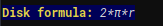

Main difference with using `skin.print_inline(format!( ... ))` to build some markdown and parse it:
* the markdown parsing and template building are done only once (using `once_cell` internally)
* the given values aren't interpreted as markdown fragments and don't impact the style
* arguments can be omited, repeated, given in any order
* no support for fmt parameters or arguments other than `&str` *(in the current version)*

Inline templates are especially convenient combined with automated expansion or ellipsis, for filling a field in a terminal application.

You'll find more examples and advice in the *inline-template* example.

#### Text Template

When you want to fill a multi-line area, for example the help page of your terminal application, you may use a text template.

A template defines placeholders as `${name}` which you may fill when using it.

For example

```
let text_template = TextTemplate::from(r#"
    # ${app-name} v${app-version}
    It is *very* ${adj}.
    "#);
let mut expander = text_template.expander();
expander
    .set("app-name", "MyApp")
    .set("adj", "pretty")
    .set("app-version", "42.5.3");
skin.print_expander(expander);
```

This would render like this:

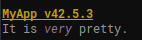

The values you set with `set` aren't parsed as markdown, so they may freely contain stars or backquotes.

A template is reusable and can be defined from a text content or any string.

By using *sub-templates*, you may handle repetitions. They're handy for lists or tables.

For example

```
let text_template = TextTemplate::from(r#"
    |:-:|:-:|:-:|
    |**name**|**path**|**description**|
    |-:|:-:|:-|
    ${module-rows
    |**${module-name}**|`${app-version}/${module-key}`|${module-description}|
    }
    |-|-|-|
    "#);
let mut expander = text_template.expander();
expander
    .set("app-version", "2");
expander.sub("module-rows")
    .set("module-name", "lazy-regex")
    .set("module-key", "lrex")
    .set("module-description", "eases regexes");
expander.sub("module-rows")
    .set("module-name", "termimad")
    .set("module-key", "tmd")
    .set_md("module-description", "do things on *terminal*");
skin.print_expander(expander);
```

to get

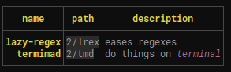

On this example, you can note that
* `sub("module-rows")` gets an expander for the sub template called `module-rows`
* `set_md` can be used when you want to insert not just a raw uninterpreted string but some inline markdown.
* you don't need to fill global placeholders again (here `${app-version}`).

If you want to insert a block of code, you may use `set_lines` which applies the line style to all passed lines.

For example

```
let text_template = TextTemplate::from(r#"
    ## Example of a code block
        ${some-function}
    "#);
let mut expander = text_template.expander();
expander.set_lines("some-function", r#"
    fun test(a rational) {
    irate(a)
    }
    "#);
skin.print_expander(expander);
```

to get

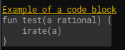

You'll find more text template functions in the documentation and in the example (run `cargo run --example text-template`).

You may also be interested in `OwningTemplateExpander`: an alternative expander owning the values which may be handy when you build them while iterating in sub templates.

### Asking questions

A frequent need in CLI apps is to ask the user to select an answer.
The `Question` API and the `ask!` macros cover most basic needs.

Here's an example of asking with a default choice (that you get by hitting *enter*) and a returned value:

```rust
let choice = ask!(skin, "Do you want to drink something ?", ('n') {
    ('w', "I'd like some **w**ater, please.") => {
        mad_print_inline!(skin, "*Wait a minute, please, I'll fetch some.*\n");
        Some("water")
    }
    ('b', "Could I get a **b**eer glass ?") => {
        mad_print_inline!(skin, "We have no glass, so here's a *bottle*.\n");
        Some("beer")
    }
    ('n', "*No*, thank you.") => {
        None
    }
});
dbg!(choice);
```

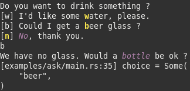

## Advices to get started

* Start by reading the examples (in `/examples`): they cover almost the whole API, including templates, how to use an alternate screen or scroll the page, etc.
* Be careful that some colors aren't displayable on all terminals. The default color set of your application should not include arbitrary RGB colors.
* The event / event-source part of Termimad is currently tailored for a short number of applications. If you use it or want to use it, please come and tell me so that your needs are taken into account!
* If your goal is to format some CLI application output, for example a few tables, have a look at [lfs](https://github.com/Canop/lfs) which is one of the simplest possible uses
* If a feature is missing, or you don't know how to use some part, come and ping me on my chat during West European hours.


## Open-source applications using termimad

* [broot](https://github.com/Canop/broot) is a file manager and uses termimad for its help screen, status information and event management

* [lfs](https://github.com/Canop/lfs) is a linux utility displaying file systems. Termimad templates are used to show the data in tables

* [SafeCloset](https://github.com/Canop/safecloset) is a secret safe. Its TUI uses Termimad a lot, especially inputs

* [Rhit](https://github.com/Canop/rhit) is a nginx log analyzer. Termimad templates are used to show the data in tables

* [bacon](https://github.com/Canop/bacon) is a background Rust compiler. It uses Termimad for display and event management

* [lapin](https://github.com/Canop/lapin) is a terminal game. It uses Termimad for display and event management

* [backdown](https://github.com/Canop/backdown) is a file deduplicator. It uses Termimad to print on screen and ask questions

If you're the author of another application using Termimad, please tell me.
