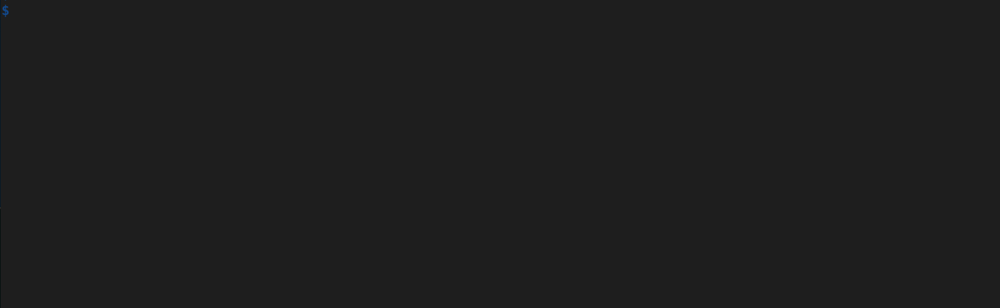

# A component-based framework for building Rust Text-based User Interfaces (TUIs)

There are several copies of this repo on GitHub,
[facebookincubator/superconsole](https://github.com/facebookincubator/superconsole)
is the canonical one.

The superconsole framework provides a powerful line based abstraction over text
based rendering to the terminal. It also provides basic building blocks like
line manipulation, and a higher level of composable components. A base set of
"batteries" components are included to help developers create Text-based User
Interfaces (TUIs) as quickly as possible.

The design choices that underly superconsole are selected to prioritize
testability, ease of composition, and flexibility.

Superconsole also offers stylization, including italics, underlining, bolding,
and coloring text. Furthermore, relying on crossterm ensures that it is
compatible with Windows, Unix, and MacOS.

Finally, superconsole delineates between rendering logic and program state -
each render call accepts an immutable reference to state, which components may
use to inject state into their otherwise immutable rendering logic.

## Demo



## Examples

```rust
use superconsole::components::bordering::{Bordered, BorderedSpec};
use superconsole::{Component, Dimensions, DrawMode, Lines, SuperConsole};

#[derive(Debug)]
struct HelloWorld;

impl Component for HelloWorld {
    fn draw_unchecked(&self, _dimensions: Dimensions, _mode: DrawMode) -> anyhow::Result<Lines> {
        Ok(Lines(vec![
            vec!["Hello world!".to_owned()].try_into().unwrap(),
        ]))
    }
}

pub fn main() -> anyhow::Result<()> {
    let bordering = BorderedSpec::default();
    let mut superconsole = SuperConsole::new().ok_or_else(|| anyhow::anyhow!("Not a TTY"))?;
    let component = Bordered::new(HelloWorld, bordering);
    superconsole.render(&component)?;
    superconsole.finalize(&component)?;
    Ok(())
}
```

See the [CONTRIBUTING](CONTRIBUTING.md) file for how to help out.

## License

Superconsole is both MIT and Apache License, Version 2.0 licensed, as found in
the [LICENSE-MIT](LICENSE-MIT) and [LICENSE-APACHE](LICENSE-APACHE) files.
